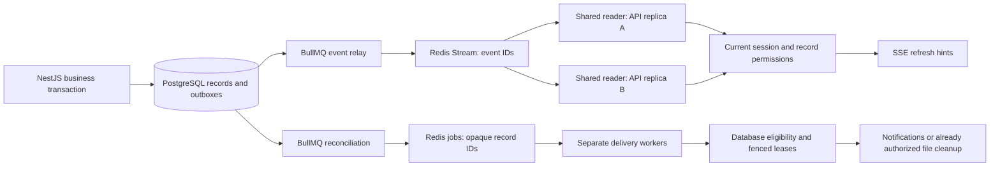

# 53 — Redis live events and background workers

Implemented locally **2026-10-09**, following the user's renewed direction for scope
items #11–12. Redis is independent of the Better Auth/Neon identity/database changes.
Client-owned production Redis and worker deployments remain pending.

## Data flow



PostgreSQL remains authoritative. Payment verification, balances, Finance adjustments,
HR decisions and deletion approvals stay in their existing synchronous audited flows.
Redis workers cannot verify money, change balances, apply wages or approve erasure.

## Live events

- Existing business transactions atomically save `ChangeEvent`. An additive migration
  adds nullable `publishedAt` and an outbox index. Saved writes never wait for Redis.
- A separate relay queue runs every second, reading committed unpublished rows under
  PostgreSQL `FOR UPDATE SKIP LOCKED`. It publishes each opaque event ID to a Redis
  Stream and then marks the row published. A lower sequence ID that commits later is
  still found; no database ID watermark can skip it.
- A crash between publication and database commit can repeat a refresh hint. This is
  deliberately safe. It never repeats a financial write.
- Each API replica uses one Redis stream reader for all its browsers. Every event ID is
  resolved against PostgreSQL; arbitrary Redis entity/body payloads are ignored.
- SSE authenticates current Better Auth sessions and checks existing record visibility
  before each hint. Revocation/MFA checks also run every second. Slow connections are
  bounded and closed so they can reconnect and fetch current state.
- Stream history is approximately 10,000 entries. Initial connections and Redis
  reconnections emit `ready` to fetch an authorized snapshot. Stream trimming/reset
  gaps are checked every 15 seconds and also trigger snapshots. Existing web hooks
  already refetch on `ready` and preserve editing drafts.
- Without `REDIS_URL`, development/older tests retain their database event polling.
  Production configuration requires Redis.

Streams retain messages and let each API reader consume its own copy; Pub/Sub would
lose messages while a reader is disconnected. See the official
[Redis XREAD documentation](https://redis.io/docs/latest/commands/xread/) and
[Redis Pub/Sub delivery semantics](https://redis.io/docs/latest/develop/use-cases/pub-sub/).

## Background jobs

The separate `src/worker.ts` process has three BullMQ queues:

| Queue | Work | Scheduling |
|---|---|---|
| `event-relay` | Publish committed database events | Every second, isolated from reminders/delivery |
| `maintenance` | Reconcile durable due outboxes; generate approved reminders | Reconcile every 5 seconds; reminders every 30 seconds |
| `deliveries` | Customer emails, staff emails, operations emails, authorized private file/local mail cleanup | Four concurrent handlers per worker |

Schedulers are idempotently registered and recreated after Redis data loss. Multiple
worker processes share jobs. Job data contains only `{ id }`; maintenance data is `{}`.
Email addresses, message text, storage keys, session tokens and provider credentials
remain outside Redis. Processing failures saved in Redis are replaced with a generic
error, and completed/failed queue history has bounded count/age retention.

BullMQ retries infrastructure failures up to five times with exponential backoff.
PostgreSQL reconciliation can redispatch jobs after Redis loss or exhausted infrastructure
retries. Database delivery counters and eligibility still bound actual external attempts.
See [BullMQ connections](https://docs.bullmq.io/guide/connections),
[job schedulers](https://docs.bullmq.io/guide/job-schedulers/) and
[idempotent jobs](https://docs.bullmq.io/patterns/idempotent-jobs).

Customer/staff email handling preserves current recipients, role/task/payment eligibility,
delivery windows and five-attempt limits. Customer emails now freeze recipient, subject,
body and sender on first claim, as staff emails already did. Both use UUID fencing
tokens and two-minute leases. Duplicate/stale workers cannot replace a newer result.
Actual sends recheck live rows under the same advisory lock as erasure. Development
messages remain private `.local/mail` files; production sends use Resend idempotency
keys. Generic operations emails also recheck active accounts and use provider keys.
External email is still subject to the provider's idempotency window; no global
exactly-once delivery claim is made.

File workers only process jobs for `FILES_PENDING` requests with an existing Owner
`retention.records_erased` execution audit. The worker completes physical deletion
before removing private file metadata, uses fenced two-minute leases, retries with
backoff, and stops after five storage attempts. The Owner's existing retry action
resets failed jobs and records an audit. Worker audits reference the original human
execution actor and identify the deferred worker action. Policy activation, request
approval and typed execution remain manual. No retention periods or automated
profile deletion are introduced.

Worker shutdown stops consumers before releasing queue/database resources. Abrupt
termination is recovered through BullMQ stalled-job handling and database leases.

## Local setup

Local Compose adds authenticated Redis 8.2 on **127.0.0.1:6380**, with AOF `everysec`,
a persistent volume and `maxmemory-policy=noeviction`. BullMQ **6.3.11** and ioredis
**6.0.0** are pinned in the API package/lockfile.

```bash
docker compose -p freshphonesph up -d
pnpm install
pnpm --filter @fresh/api-ts db:generate
pnpm --filter @fresh/api-ts db:migrate
# Run each service in its own terminal:
pnpm --filter @fresh/api-ts dev
pnpm --filter @fresh/api-ts worker:dev
pnpm --filter @fresh/web dev
```

Set these API/worker variables in the private `.env`:

```dotenv
REDIS_URL=redis://:fresh-local-redis@localhost:6380/0
REDIS_NAMESPACE=freshphones-local
```

API and worker use the same database, namespace and private storage configuration.
Their working directory must be `apps/api-ts` (workspace scripts already do this) so
local private storage/mail paths agree. Production uses private S3 and real email.
Built worker command: `pnpm --filter @fresh/api-ts worker:start`.

## Operations and recovery

- `GET /api/health` checks database connectivity independently of Redis.
- `GET /api/health/redis` returns 200 only when Redis is connected and a worker heartbeat
  exists (30-second TTL); otherwise it returns 503 with a generic message.
- Owner-only `GET /api/operations` shows Redis/worker status, queue counts, unpublished
  events and terminal database delivery failures. It returns no recipient/message data.
- Existing staff delivery/retention screens retain their audited retry controls.
  Generic notification management requests queue work when Redis is enabled.
  Committed reminder-setting changes request background work; Redis outages leave the
  saved settings intact for the recurring worker to read after recovery. The retention
  screen listens to Owner-only progress events and keeps approval/reason drafts intact.
- During a Redis outage, committed business writes remain available and outboxes wait.
  Restore Redis/start a worker; readers refetch and workers reconcile due database rows.
- A lost Redis volume also requires scheduler re-registration (automatic within ten
  seconds). Previously published events are represented by the new authorized snapshot.
  Pending database jobs are redispatched. Preserve PostgreSQL and private object storage.
- Use distinct namespaces/credentials per environment. Never run global Redis flushes
  against a shared deployment.

## Verification and production gate

`pnpm --filter @fresh/api-ts test:redis` requires a migrated dedicated
`TEST_DATABASE_URL` ending in `_test` and `TEST_REDIS_URL`. The suite uses its own
random Redis namespace and synthetic people/files. The optional actual restart test
requires `TEST_REDIS_RESTART_CONTAINER=fresh-redis-test`, the isolated test container
on loopback port 6381; it never stops the preview Redis service.

Local evidence covers two API replicas, recipient isolation/session revocation,
rollback and late-commit publication, minimal payloads, separate workers, duplicate
delivery, frozen payloads/fencing, retries, restart recovery, executed file cleanup,
bounded storage failures, stream replacement and a real Redis outage.

Verified on 2026-10-09:

| Check | Result |
|---|---|
| API units | 63 passed |
| Full PostgreSQL regression | 152 passed |
| Redis/PostgreSQL integration, two API and worker instances | 14 passed |
| Retention regression after progress-event wiring, fresh database | 9 passed |
| Web tests | 61 passed |
| API typecheck/build and web typecheck | Passed |
| Prisma migration/schema diff | Empty (no schema drift) |
| Preview health and local demo accounts | Redis worker healthy; all four roles sign in |
| Retention browser smoke check | Rendered with no browser errors or mobile overflow |
| Local launch checks and shell syntax | Passed |

The full regression preceded the final retention progress-event wiring; focused Redis
and retention suites verify that addition. The local preview database was backed up
privately before the additive migration. Test fixtures used dedicated databases and
an isolated Redis container; no production service was changed.

Before production: provision client-owned authenticated Redis with AOF/no eviction,
private networking or remote TLS (`rediss://`), a unique namespace, worker services,
monitoring and adequate shutdown grace. Configuration rejects unauthenticated Redis
and public plaintext production connections. Rehearse two replicas, target capacity,
Redis volume loss, database/object-store restoration and email provider recovery in
staging. Approved notices/retention policies, sender setup, private storage, named UAT
remain open. Scope #13 abuse limits are now implemented locally; see
[54-abuse-rate-limits.md](54-abuse-rate-limits.md) for defaults, outage behavior and proxy/quota acceptance.
