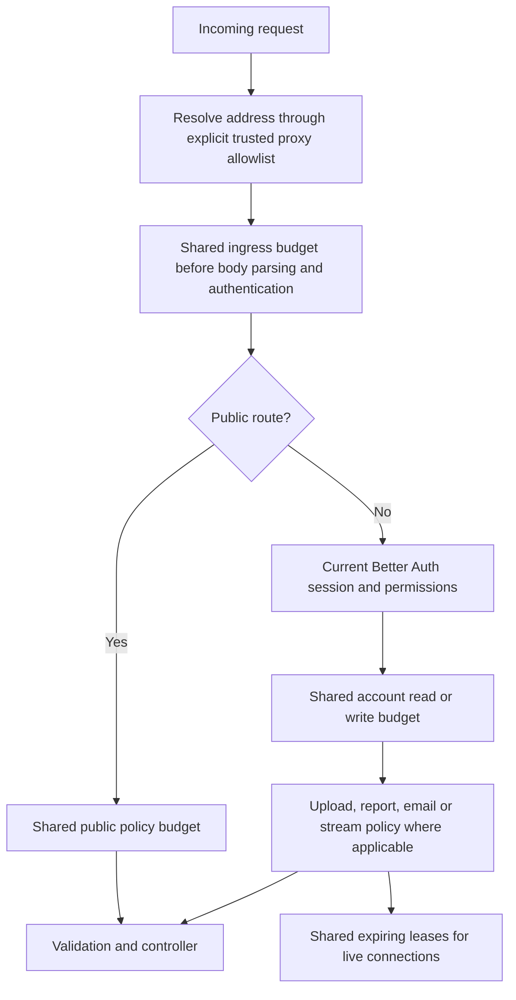

# 54 — Broader abuse rate limiting

Implemented locally **2026-10-09**, scope #13. Redis counters are shared by every API
replica. PostgreSQL provides shared protection when Redis is unavailable or omitted for
local development. Protection remains enabled in development, tests and production.
Production proxy configuration, traffic tuning and staging load acceptance remain open.

## Request flow



## Defaults

Each window starts with its first attempt. Multiple windows apply together; every
attempt consumes the applicable budget, including validation failures. Denied requests
do not extend the expiration. Counters saturate at the maximum plus one.

| Policy | Default | Subject and coverage |
|---|---|---|
| `ingress` | 1,200/minute | Every request per address group, including unknown paths, bad origins, preflight and malformed JSON, before parsing/authentication |
| `health` | 120/minute | Separate bounded address budgets for GET/HEAD health probes; ordinary API saturation does not exhaust this budget |
| `publicRead` | 240/minute | Public catalog, published product images, careers and legal documents per address group |
| `auth` | 60/minute | Public login/recovery/MFA/refresh/logout and authenticated credential changes; existing stricter database login/password and Better Auth factor limits also apply |
| `application` | 5/hour and 20/day | Public job applications, shared across jobs, payloads, attachments and API replicas |
| `agentLookup` | 30/minute and 300/hour | Both `/api/agents/verify` and `/api/recruitment/agents/verify`, shared across query values and replicas |
| `accountRead` | 600/minute | Authenticated reads per current account, shared across sessions and routes |
| `accountWrite` | 120/minute | Authenticated mutations per current account, shared across record IDs and routes |
| `upload` | 20/minute and 120/hour | All current file-upload controllers, including receipt scanning, payment proofs, documents, task attachments and catalog photos; separate address and account budgets |
| `download` | 120/minute | All current private file download controllers, including requirements, proofs, task/applicant attachments and staff catalog photos; separate address and account budgets |
| `expensive` | 60/minute | Reports/exports, statements and payment confirmations; separate address and account budgets |
| `email` | 10/hour | Owner test reminder email action; separate address and account budgets, plus its existing stricter service control |
| `stream` | 400/minute | SSE connection attempts per address group |
| `streamAccount` | 40/minute | SSE connection attempts per account, across sessions and replicas |

Authorization still runs before account-specific work. A rejected role retains its
401/403/MFA/privacy status until the earlier ingress/public protection is exhausted.
Rate budgets do not authorize any action, verify a payment or enqueue a financial write.

HTTP 429 responses include a positive integer `Retry-After` and a plain wait message.
Responses have `Cache-Control: no-store`; CORS exposes `Retry-After` to the configured web
origin. Browser reads, uploads and downloads preserve this information without retrying a
blocked submission or declaring the session expired. Agent verification displays the wait
message; application drafts remain in the form. SSE reconnects use exponential backoff
with jitter and respect a wait returned by the session check.

## Shared storage and outages

- Redis uses one Lua operation to increment and expire all windows atomically. Keys
  include the deployment namespace and a Redis hash tag for the policy counters.
  This follows the atomic counter/expiry guidance in the
  [Redis INCR documentation](https://redis.io/docs/latest/commands/incr/).
- Redis decisions have a one-second command timeout, disabled offline buffering and a
  brief retry cooldown. Connection errors and addresses are never logged by this service.
- If Redis cannot decide, one PostgreSQL upsert atomically consumes the same policy's
  fallback windows across API replicas. Database statement/transaction waits are bounded.
  A Redis denial is final; it does not try the fallback to obtain another allowance.
- **Backend switches use independent counters.** Switching to fallback or recovering
  after lost Redis data can admit an additional configured window budget. Existing strict
  authentication counters remain in PostgreSQL throughout. This bounded allowance must
  be considered when choosing production application/upload quotas; counter continuity
  across Redis data loss is not claimed.
- If neither shared store can protect the request, return a generic HTTP 503 with
  `Retry-After: 5`. There is no per-process unlimited fallback.
- Address groups normalize IPv4-mapped addresses and combine IPv6 privacy addresses
  within a /64. Server-defined policy names prevent query/path/record-ID rotation from
  creating fresh budgets. Authenticated keys use the current account ID, never a caller's
  supplied user ID or unsigned cookie.
- HMAC-SHA256 digests use the server identity secret and environment namespace. Redis
  values are integers only; PostgreSQL fallback rows contain digest/count/reset time only.
  No email, raw IP, cookie, token, query, filename or request body is stored in these keys.
  Redis TTLs expire counters. Every API performs bounded expired-row cleanup once per minute.

`GET /api/operations` remains Owner-authorized and includes `rateLimits.backend` and
Redis readiness for that replica. These are readiness observations, not fleet-wide metrics.

## Live connection caps

PostgreSQL leases cap simultaneous SSE connections across replicas and Redis outages:
**8 per account and 400 per address group** by default. Leases contain HMAC digests,
random IDs and expiration only. Admission/counting is serialized with a separate advisory
lock; it does not take the Finance/retention write lock.

Leases renew every 30 seconds and expire after 90 seconds. Disconnect/shutdown releases
them. A dead replica's leases expire automatically. Failure to renew closes the connection;
an independent 85-second deadline prevents a hung renewal from outliving its lease.
Clients can still read ordinary pages when their live connection cap is reached.

## Configuration and deployment

All API replicas must use the same `REDIS_URL`, `REDIS_NAMESPACE`, identity secret and
limits. The additive migration `20261009050000_abuse_limits` creates `AbuseBucket` and
`AbuseStreamLease`; it changes no existing accounts or business records. Back up first,
deploy the migration, then restart API replicas. Workers retain their existing jobs.

Optional environment settings:

```dotenv
# Unset for direct local API access.
TRUSTED_PROXY_CIDRS=127.0.0.1/32,::1/128
# JSON: policy -> [[maximum, windowSeconds], ...]. Unspecified policies keep defaults.
ABUSE_LIMITS={"agentLookup":[[30,60],[300,3600]],"application":[[5,3600],[20,86400]]}
ABUSE_STREAM_ACCOUNT_MAX=8
ABUSE_STREAM_ADDRESS_MAX=400
```

Only set `TRUSTED_PROXY_CIDRS` after checking the actual VPS/Railway gateway path.
The proxy must overwrite or safely append forwarded client addresses, and direct API
access must not let callers impersonate a trusted proxy. Arbitrary forwarded headers
are ignored by default. Blanket `/0` trust is rejected. Better Auth receives Express's
resolved address through the same allowlist. See
[Express's proxy guidance](https://expressjs.com/en/guide/behind-proxies/).

Quota configuration rejects unknown policies, empty windows, non-positive numbers and
unbounded window lengths. There is no protection-off setting. Shared office/mobile
networks need particular attention to address-wide upload/auth budgets; tune with measured
traffic instead of identifying callers through arbitrary headers.

Before production acceptance:

1. Confirm the gateway overwrites forwarded headers and that API replicas cannot be bypassed.
2. Test shared counters through both real replicas, including IPv6, shared networks,
   uploads, session changes and ordinary Finance work during a Redis outage.
3. Rehearse Redis stop, network stalls, recovery and data loss; monitor fallback database
   load and understand the independent-counter allowance described above.
4. Verify the 100-concurrent-session/20-request-per-second capacity target, then record
   deployment quotas and stream caps. Infrastructure-level connection/body/DDoS protection
   remains the gateway's responsibility; application limits begin after a connection reaches the API.

## Verification

Use a fresh migrated `TEST_DATABASE_URL` ending in `_test` and a separate disposable
Redis instance. Never pause or stop preview/production Redis for these tests.

```bash
pnpm --filter @fresh/api-ts db:generate
# Supply private TEST_DATABASE_URL and TEST_REDIS_URL in the shell environment.
pnpm --filter @fresh/api-ts test:abuse
# Set TEST_ABUSE_REDIS_CONTAINER=fresh-redis-test only for the disposable local container.
pnpm --filter @fresh/api-ts test
pnpm --filter @fresh/api-ts test:integration
NEXT_PUBLIC_API_BACKEND=typescript pnpm --filter @fresh/web test
pnpm --filter @fresh/api-ts typecheck
pnpm --filter @fresh/api-ts build
pnpm --filter @fresh/web exec tsc --noEmit
```

The focused suite exercises actual Redis/PostgreSQL concurrency, both lookup aliases,
headers/query/session rotation, default and multiple-window application quotas, invalid
input, uploads stopped before parsing/scanning/storage, private downloads and report limits, HMAC/TTL privacy,
proxy configuration, live leases, failure of both stores, and disposable Redis stop/stall
recovery. Legacy parity fixtures clear only test database counters between scenarios;
their deliberately large application/report fixtures use explicit test quotas. Production
defaults are not weakened.

### Local evidence — 2026-10-09

| Check | Result |
|---|---|
| Focused abuse suite with real Redis stop and network stall | 23/23 passed |
| Existing PostgreSQL business/auth/retention regressions | 152/152 passed |
| Redis events and worker regressions | 14/14 passed |
| API unit checks | 63/63 passed |
| Web client checks, including 429 and session recovery | 63/63 passed |
| API/web typechecks and API build | Passed |
| Preview database vs Prisma schema | No drift |
| Mobile agent lookup 429 | Wait displayed; search preserved; no page errors |
| Four seeded local roles | Login and current session checks passed |
| Local launch checks | Web, database, Redis/worker and private storage checks passed |

The full regression began before the final private-download annotations; the final focused
abuse suite verifies those controls. The preview was backed up privately before the additive
migration. Test fixtures and outage checks used dedicated databases and disposable Redis;
production services were not changed. Local API, worker and web preview remain running.
